Jenkins Pipeline Lab For Beginners 
=======================================


Jenkins pipeline as code is a concept of defining Jenkins build pipeline
in Jenkins DSL/Groovy format. This lab covers the key concepts
involved in writing Jenkins pipeline as code using declarative syntax.


[Jenkins Pipeline Lab]
-------------------------------------------------------

In this Jenkins pipeline lab, we will look at the following

1.  Types of Jenkins Pipeline
2.  Pipeline as code basics
3.  Building a basic CI pipeline as code for java app.
4.  Building a job from pipeline code present in source code repo.
5.  Executing parallel stages in a pipeline
6.  Generating pipeline script & directives using Jenkins inbuilt
    generators.

### [Types of Jenkins Pipeline]

There are two types of Jenkins pipeline code.

1.  Declarative Pipeline
2.  Scripted Pipeline

In this lab, we will focus only on the declarative syntax as it is
an advanced version of the scripted pipeline with extensible features.
Also, I recommend using the declarative pipeline approach for all your
Jenkins use cases. There are a lot of features and benefits you will get
from the declarative pipeline approach.

Now let's get started with the pipeline lab.

For better understanding, we will create a pipeline for the **Java
Spring Boot application** build using the declarative pipeline as code.

### [ Prerequisites]

1.  **Jenkins**
2.   **Access to Github.com** from your Jenkins server. If you are trying
    out from your corporate Jenkins setup, you can use your
    organization's private git repo.

Here us the pictorial representation of the simple build pipeline we are
going to build.

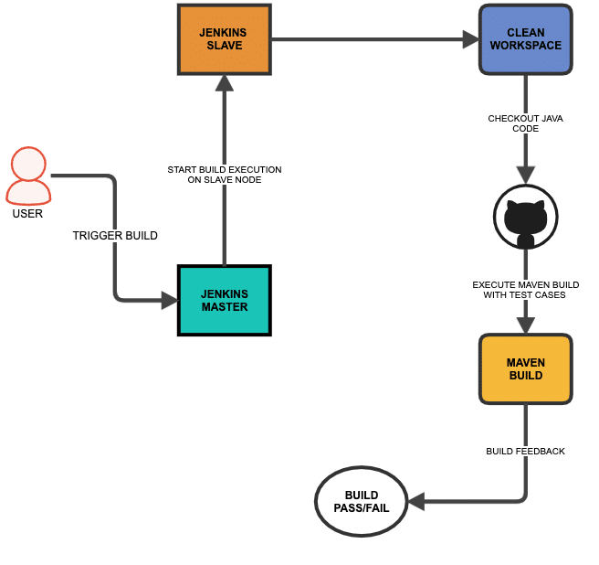

Here is the pipeline code for the above workflow. Before setting up the
pipeline we will understand what each block means.

> **Note:** Do not worry about the DSL used in the pipeline code. Read
> the lab fully to understand how to generate the DSLs in an easy
> way.

```
pipeline {

    agent {
        node {
            label 'master'
        }
    }

    tools { 
        maven 'maven3' 
    }

    options {
        buildDiscarder logRotator( 
                    daysToKeepStr: '15', 
                    numToKeepStr: '10'
            )
    }

    environment {
        APP_NAME = "DCUBE_APP",
        APP_ENV  = "DEV"
    }

    stages {
        
        stage('Cleanup Workspace') {
            steps {
                cleanWs()
                sh """
                echo "Cleaned Up Workspace for ${APP_NAME}"
                """
            }
        }

        stage('Code Checkout') {
            steps {
                checkout([
                    $class: 'GitSCM', 
                    branches: [[name: '*/master']], 
                    userRemoteConfigs: [[url: 'https://github.com/spring-projects/spring-petclinic.git']]
                ])
            }
        }

        stage('Code Build') {
            steps {
                 sh 'mvn install -Dmaven.test.skip=true'
            }
        }

        stage('Priting All Global Variables') {
            steps {
                sh """
                env
                """
            }
        }

    }   
}
```

Now lets understand what each block means.


1.  **The Pipeline Block:** All your pipeline as code should be wrapped
    inside the pipeline block.

```
pipeline {

---<All Pipeline blocks go here>---

}
```


1.  **Agent Block:** In the agent block you have to mention the node
    details where you want to run the pipeline job.
    Here we have mentioned label as "`master`". It is the name of a
    node.

```
    agent {
        node {
            label 'master'
        }
    }
```

1.  **Tools Block:** Here you can refer to the tools you have configured
    in the Jenkins Global tool configuration. We have covered the tool
    configuration in the next section.

```
tools { 
        maven 'maven3' 
    }
```

1.  **Options Block:** It contains all the options required for the job.
    One example, we have given is "Build Discarder" to rotate the build
    logs.

```
options {
        buildDiscarder logRotator( 
                    daysToKeepStr: '15', 
                    numToKeepStr: '10'
            )
    }
```

1.  **Environment Block:** In this block, you can mention all the
    required variables for the job which has to be available in all the
    stages. You can define any number of variables like a key-value
    pair.

```
    environment {
        APP_NAME = "DCUBE_APP",
        APP_ENV  = "DEV"
    }
```

1.  **Stages:** Stages block contains multiple stages.

```
stages {

---<All Pipeline Stages Go Here>---

}
```

1.  **Stage Block:** A stage is a subset of stages. Each stage has a
    `steps` block.

```
<!-- -->
```
1.  **Steps Block:** In each `steps` block you define a set of
    operations to perform. In the following example, we have shown a
    workplace cleanup step and echoing a variable we defined in the
    environment block. What you want to run inside each stage depends
    totally on your use case.

```
stage('Cleanup Workspace') {
            steps {
                cleanWs()
                sh """
                echo "Cleaned Up Workspace for ${APP_NAME}"
                """
            }
        }
```

Now that we have a basic understanding of a minimal pipeline as code,
lets practically execute this pipeline on a Jenkins server with a
node.

[Configure Pipeline as Code Job In Jenkins]
---------------------------------------------------------------------------------------

To execute the pipeline code we have in this lab, we need to
configure maven in global tool configuration.

Go to Manage Jenkins --\> Global Tool Configuration --\> Maven --\>
Maven Installation.

Add a maven configuration as shown below. We are using the tool name as
`maven3` in the pipeline, so that it refers to the maven under "Global
Tool Configuration".

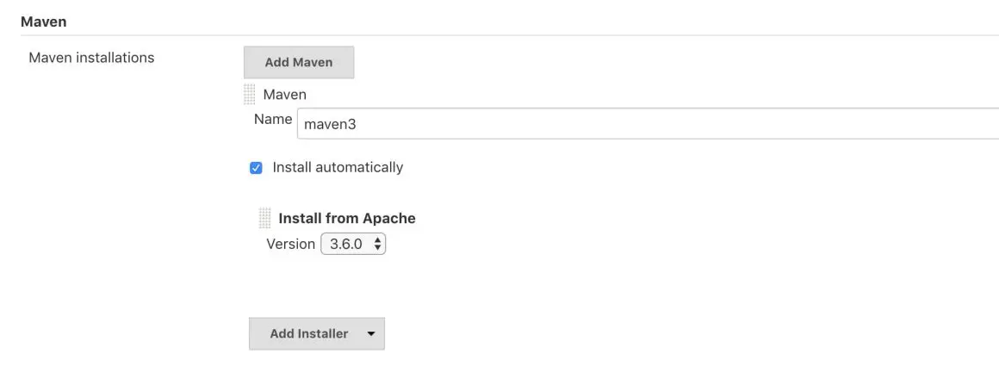

> **Note:** We have selected "Install Automatically" option, which will
> download the selected version every time you execute the job.

### [Creating & Building a Jenkins Pipeline Job]

Follow the steps given below to create and build our pipeline as code.

**Step 1:** Go to Jenkins home and select "New Item"

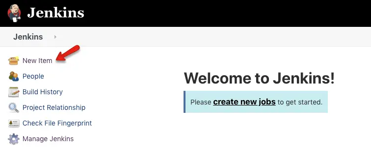

**Step 2:** Give a name, select "Pipeline" and click ok.

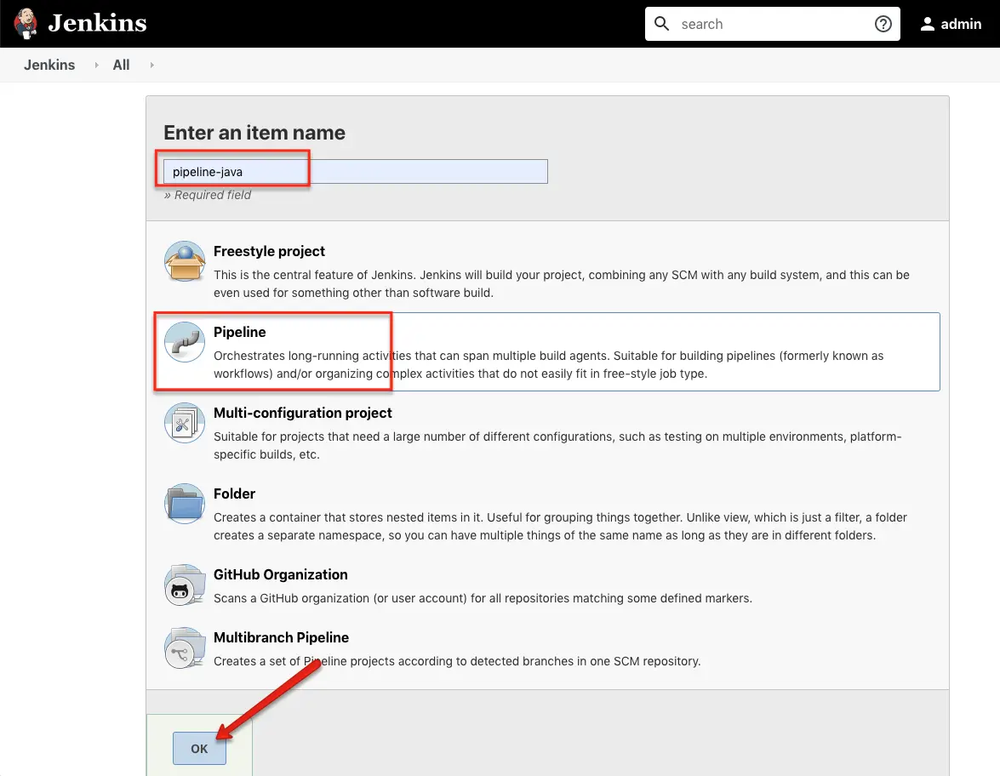

**Step 3:** Scroll down to the Pipeline section, copy the whole pipeline
code in the script section and save it.

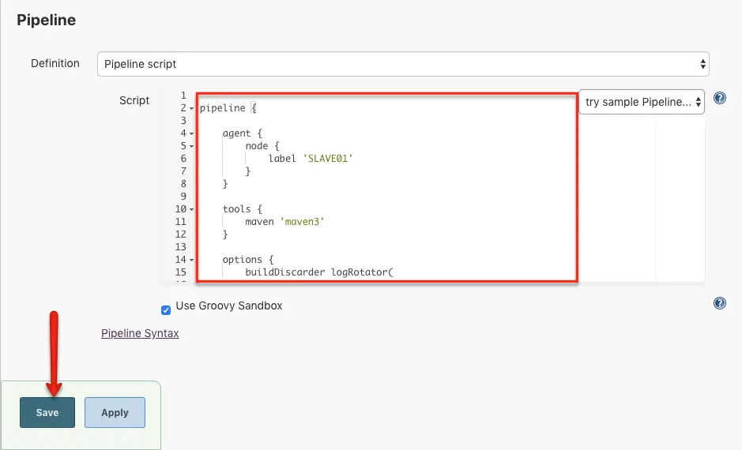

**Step 4:** Now, click "Build Now" and wait for the build to start.

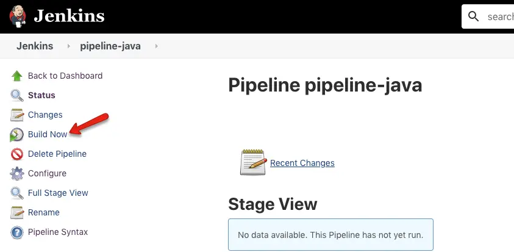

While the job starts you can view each stage executing in stage view.
Here is the screenshot of a successfully executed job. Also, you can the
job logs by clicking the blue icon.

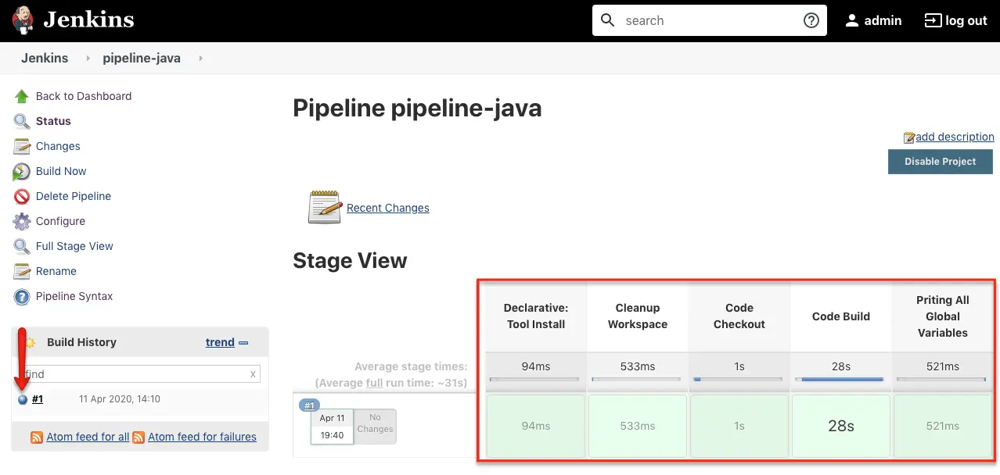

If you have the blue ocean plugin installed, you can have a very good UI
to view your job status and logs as shown below. Use the "Open in Blue
Ocean" from the left to open a job in the blue ocean view.

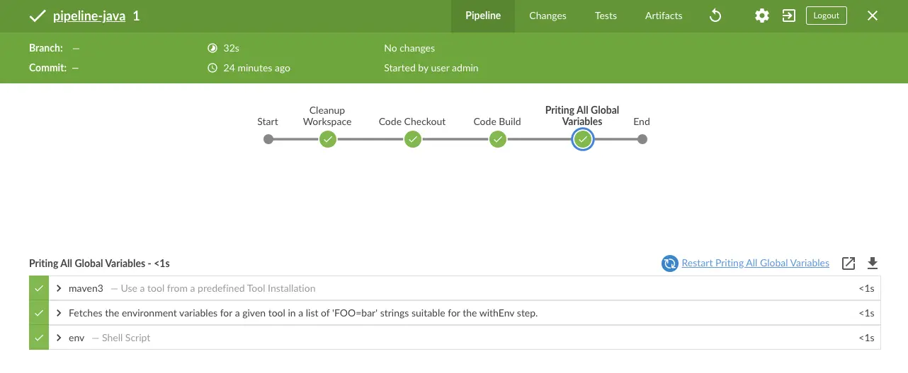

### [Executing Jenkins Pipeline From Github (Jenkinsfile)]

In the last section, we used the pipeline script directly on Jenkins. In
this section, we will look at how to execute a pipeline script available
in an SCM system like Github.

**Step 1:** Create a Github repo with our pipeline code in a file named
`Jenkinsfile`. Or you can use this Github repo for testing.
<https://github.com/fenago/pipeline-as-code-demo>

**Step 2:** Follow the same steps we used for creating a pipeline job.
But instead of entering the code directly into the script block, select
the "Pipeline script from SCM" option and fill in the details as shown
below.

1.  **Definition:** Pipeline script from SCM
2.  **Repository URL:**
    <https://github.com/fenago/pipeline-as-code-demo>
3.  **Script Path:** Jenkinsfile

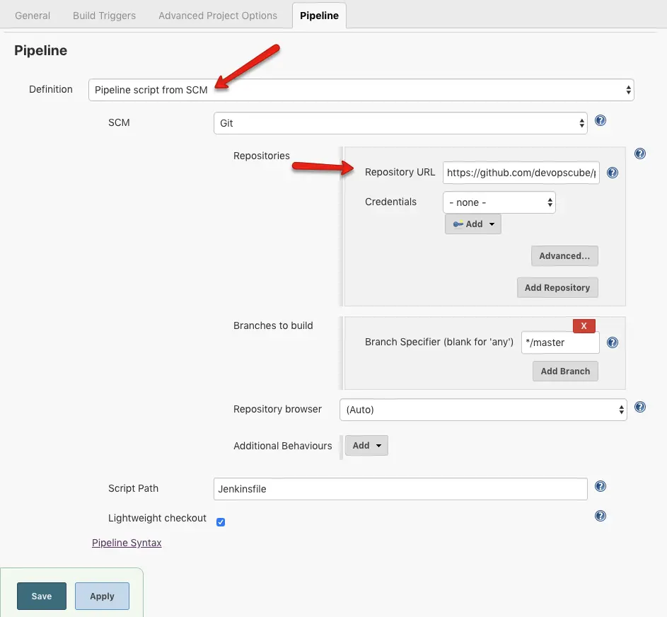

**Step 3:** Save the configuration and run the build. You should see a
successful build.

[Executing Jenkins Pipeline Stages In Parallel]
-----------------------------------------------------------------------------------------------

There are use cases where you have to execute different stages in
parallel because each stage will be independent and does not depend on
other steps. Also, running separate stages in parallel will reduce the
build times as well.

You can achieve parallelism in Jenkins pipelines as code using the
**parallel block.**

Here is an example stage that contains three parallel stages. It's like
you will have multiple stages inside a stage. You can test this by
adding the following code to your existing pipeline.

```
stage('Environment Analysis') {

            parallel {

                stage('Priting All Global Variables') {
                    steps {
                        sh """
                        env
                        """
                    }
                }

                stage('Execute Shell') {
                    steps {
                        sh 'echo "Hello"'
                    }
                }

                stage('Print ENV variable') {
                    steps {
                        sh "echo ${APP_ENV}"
                    }
                }

            
            }
        }
```

You can clearly see the parallel execution on blue ocean view.

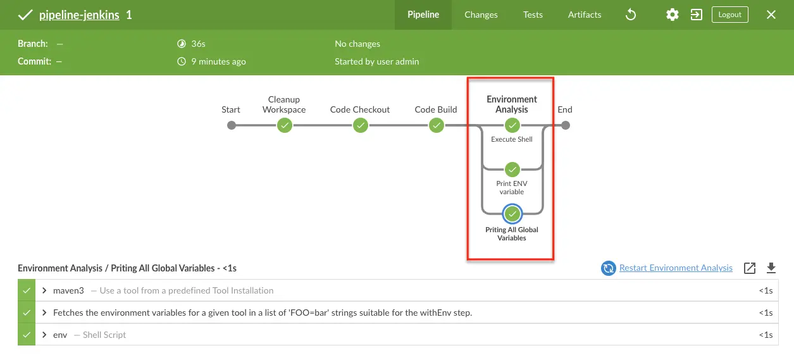

[How to Generate Jenkins Pipeline Scripts?]
--------------------------------------------------------------------------------------

It is possible to generate Jenkins pipeline scripts?

Yes! you can generate most of the pipeline scripts from Jenkins. Here is
how it works.

Jenkins has its own pipeline script generator. You can access the
generator on `/pipeline-syntax` path.

```
http://<your-jenkins-ip>:port/pipeline-syntax/
```

You can also get the syntax generator path from your pipeline job
configuration as shown below.

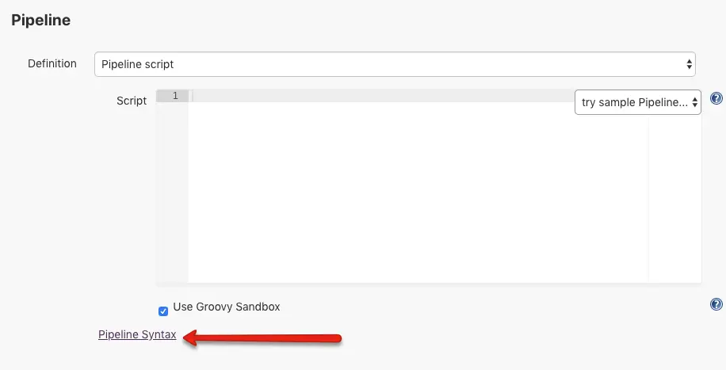

### [Snippet Generator]

Snippet generator is used for generating all the scripts that are using
inside the stages.

Here is how the generator looks. You can select the required option from
the steps dropdown, fill in the required details and generate the script
to use in your pipeline.

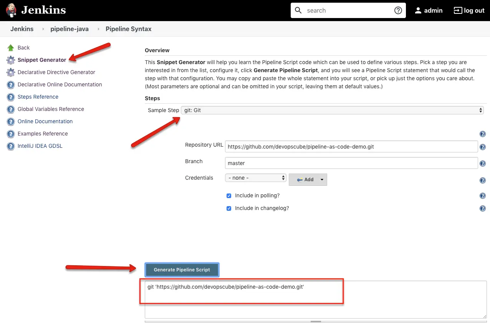

### [Declarative Directive Generator]

You can use the directive generator to generate all other options in the
pipeline. For example, options, parameters, triggers, etc.

Here is an example of generating the agent block.

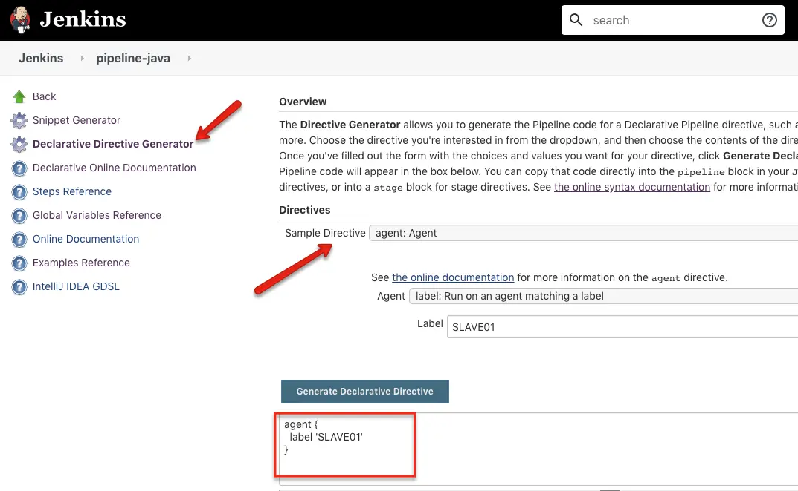

[Conclusion]
-------------------------

Adopting pipeline code for all Jenkins workflows will give more control
and streamlined pipelines for your CI/CD need.