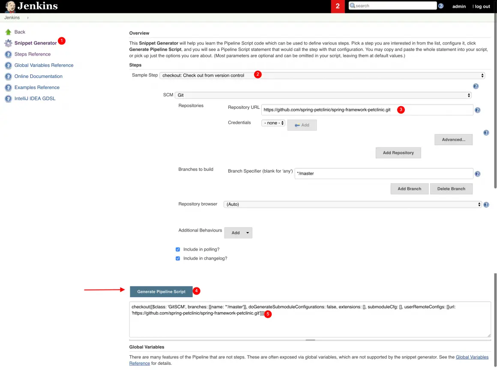
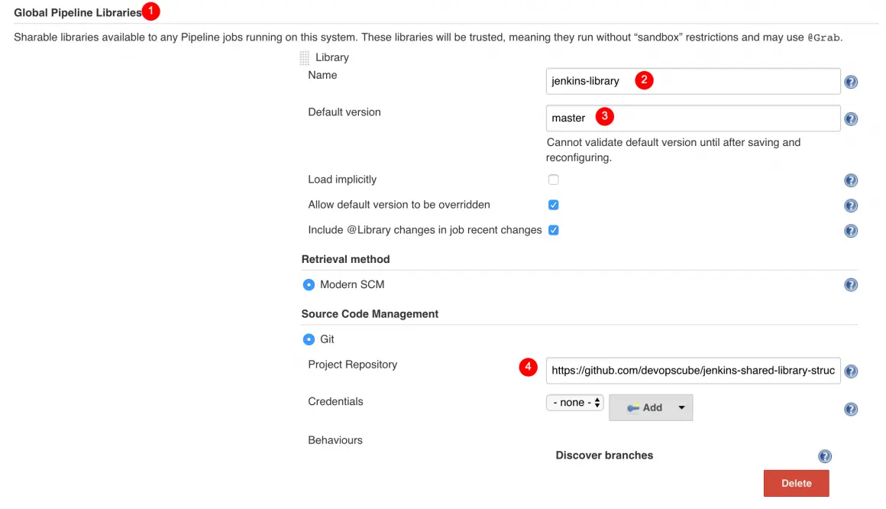

How To Create Jenkins Shared Library For Pipelines 
==================================================


In this lab, you will learn how to create a basic shared library
and integrate it with Jenkins and a sample pipeline.

We will look into the following four things to get your hands dirty with
the shared library.

1.  Create a Shared Library Structure
2.  Create Custom Shared Library Code
3.  Configure Shared Library In Jenkins Configuration
4.  Create Declarative Pipeline as Code With Shared Library.

Let looks at each one in detail.

### Create a Shared Library Structure

***Note:** In this guide, we will be concentrating only on the vars
folder for creating your first shared library. src and resources will be
covered in the advanced shared library guide.*

Jenkins shared library has the following structure. You can get the
basic structure and code used in this lab from Github -\> [Jenkins
Shared Library
Structure](https://github.com/fenago/jenkins-shared-library-structure.git)

```
jenkins-shared-library
|____vars
|____src
|____resources
```

All the files under vars are global functions and variables. The file
name is the function name. We will be using the filename in our
declarative pipeline.

### Create Custom Shared Library Code

In this section, we will create the shared library code for Git Checkout
functionality.

#### Generate Pipeline Syntax Using Snippet Generator:

You can create the code snippets that can be used in share library
function using the Pipeline Syntax Generator available in Jenkins. This
will make our life easier for creating custom library DSL. All the
supported pipeline functionality can be generated from the snippet
generator.

You can access the syntax generator from your Jenkins on
/pipeline-syntax/ path. For example,

```
http://host-ip:8080/pipeline-syntax/
```

Here is the screenshot which shows creating a git checkout pipeline
snippet using the pipeline syntax generator.



Number 5 in the screenshot shows the generated snippet. Here is the
properly formatted checkout snippet.

```
checkout([
    $class: 'GitSCM', 
    branches: [[name: '*/master']], 
    doGenerateSubmoduleConfigurations: false, 
    extensions: [], 
    submoduleCfg: [], 
    userRemoteConfigs: [[url: 'https://github.com/spring-projects/spring-petclinic.git']]
    ])
```

### Create a Shared Library For Git Checkout

Lets convert the checkout snippet we generated in the above step to a
shared library.

Create a file named `gitCheckout.groovy` under vars folder.

Here is our Git Checkout shared library code. We have removed all the
empty checkout parameters which got generated by default.

```
def call(Map stageParams) {

    checkout([
        $class: 'GitSCM',
        branches: [[name:  stageParams.branch ]],
        userRemoteConfigs: [[ url: stageParams.url ]]
    ])
  }
```

Here is the code explanation,

1.  `def call(Map stageParams)` -- A simple call function which accepts
    a Map as an argument. From the pipeline stage, we will pass multiple
    arguments which get passed as a map to the shared library.
2.  `stageParams.branch` -- its the branch parameter which comes from
    the pipeline stage and we use `stageParams` to access that variable
    in the shared library.

Commit the changes and push it to your repository.

### Add Github Shared Library Repo to Jenkins

Now that we have a basic git checkout library ready lets add it to
Jenkins configurations.

**Step 1:** Go to Manage Jenkins --\> Configure System

**Step 2:** Find the **Global Pipeline Libraries** section and add your
repo details and configurations as shown below.



### Use Checkout Library in Declarative Pipeline

We always call the library using the filename under vars. In this case,
gitCheckout is the filename created under vars. Here is how we call
`gitCheckout` library from the pipeline or Jenkinsfile

```
stage('Git Checkout') {
    gitCheckout(
        branch: "master",
        url: "https://github.com/spring-projects/spring-petclinic.git"
    )
}
```

As you can see we are passing `branch` and `url` parameter to the
Checkout function. Here is the full declarative pipeline code.

```
@Library('jenkins-library@master') _

pipeline {
    agent any
    stages {
        stage('Git Checkout') {
            steps {
            gitCheckout(
                branch: "master",
                url: "https://github.com/spring-projects/spring-petclinic.git"
            )
            }
    }
    }
}
```

Like gitCheckout, you can create all your pipeline steps a shared
library and you don't have to repeat your common functionalities in all
your pipelines.
