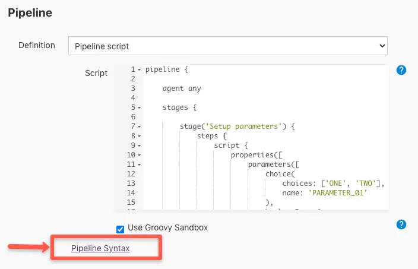
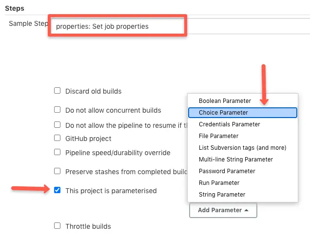

How to Use Parameters in Jenkins Declarative Pipeline 
=====================================================


In [Jenkins's declarative pipeline],
you can add parameters as part of Jenkinsfile. There are many supported
parameters types that you can use with a declarative pipeline.

In this blog, you have answers to the following.

1.  How to use parameters in the declarative pipeline?
2.  How to use dynamic parameters or active choice parameters in the
    declarative pipeline?


##### Table of Contents 

1. Generating Pipeline Code for Parameters
2. Using Parameters in Jenkinsfile
3. Access Parameters Inside Pipeline Stages
4. Using Active Choice Parameter in Declarative Pipeline for Dynamic Parameters
5. Jenkinsfile Parameter Best Practices
6. Jenkinsfile Parameter FAQs


Generating Pipeline Code for Parameters
---------------------------------------

You can generate the parameter pipeline code block easily using the
Jenkins pipeline generator. You will find the Pipeline syntax generator
link under all the pipeline jobs, as shown in the image below.





Navigate to the pipeline generator in Jenkins and under steps, search
for properties, as shown below.





Using Parameters in Jenkinsfile
-------------------------------

This script given below has the following parameter types.

1.  Choice parameters
2.  Boolean parameter
3.  Multi-line string parameter
4.  String Parameter

Here is the [Github
link](https://github.com/fenago/declarative-pipeline-examples/blob/master/parameters/Jenkinsfile.staticParametes)
for this code.

```
pipeline {
    agent any
    stages {
        stage('Setup parameters') {
            steps {
                script { 
                    properties([
                        parameters([
                            choice(
                                choices: ['ONE', 'TWO'], 
                                name: 'PARAMETER_01'
                            ),
                            booleanParam(
                                defaultValue: true, 
                                description: '', 
                                name: 'BOOLEAN'
                            ),
                            text(
                                defaultValue: '''
                                this is a multi-line 
                                string parameter example
                                ''', 
                                 name: 'MULTI-LINE-STRING'
                            ),
                            string(
                                defaultValue: 'scriptcrunch', 
                                name: 'STRING-PARAMETER', 
                                trim: true
                            )
                        ])
                    ])
                }
            }
        }
    }   
}
```

> **Note:** The parameters specified in the Jenkinsfile will appear in
> the job only after the first run. Your first job run will fail as you
> will not be able to provide the parameter value through the job.

Access Parameters Inside Pipeline Stages
----------------------------------------

You can access a parameter at any stage of a pipeline. Accessing
parameters in stages is pretty straightforward. You just have to use
params.\[NAME\] in places where you need to substitute the parameter.

Here is an example of a stage that will be executed based on the
condition that we get from the choice parameter.

The parameter name is `ENVIRONMENT`, and we access it in the stage as
`params.ENVIRONMENT`. So when the choice parameter matches PROD, it will
execute the steps mentioned in the stage.

```
stage('Deploy to Production') {
            when {
                expression { 
                   return params.ENVIRONMENT == 'PROD'
                }
            }
            steps {
                    sh """
                    echo "deploy to production"
                    """
                }
            }
   }
```

Using Active Choice Parameter in Declarative Pipeline for Dynamic Parameters
----------------------------------------------------------------------------

Unlike default parameter types, the Active choice parameter type gives
you more control over the **parameters using a groovy script**. You can
have dynamic parameters based on user parameter selection.

To use the active choice parameter, you need to have an [Active
Choices](https://plugins.jenkins.io/uno-choice/) plugin
installed in Jenkins.

Here is a small use case for an active choice parameter.

1.  A job should have three parameters
    -   Environment (dev, stage & prod)
    -   AMI List (Should list the AMIs based on environment)
    -   AMI information (Show information about the AMIs related to a
        specific environment)
2.  If the user selects dev, the AMI list should dynamically change the
    values related to dev and show information related to the AMIs.


There are three types of active choice parameters.

### Active Choices Parameter

Thi parameter type returns a set of parameters returned by the groovy
script. For example, an environment parameter that lists dev, stage, and
prod values.

```
return['dev','stage','prod']
```

You can also return values from third-party APIs as parameters.

One such example is dynamically showing folders from a Github repo in
the Jenkins parameters. To make this work you just need to write a
groovy script that calls Github APIs and query the folders of the
specific repository.

### Active Choices Reactive Parameter

Returns parameters based on conditions based on another referenced
parameter. You can refer to an active choice parameter and return a
parameter based on a condition. For example, if the environment
parameter is selected as a dev, the reactive parameter will return AMI
ids for dev based on groovy conditions.

In the following example, `Env` is the reference parameter.

```
if (Env.equals("dev")){
    return["ami-sd2345sd", "ami-asdf245sdf", "ami-asdf3245sd"]
}
else if(Env.equals("stage")){
    return["ami-sd34sdf", "ami-sdf345sdc", "ami-sdf34sdf"]
}
else if(Env.equals("prod")){
    return["ami-sdf34", "ami-sdf34ds", "ami-sdf3sf3"]
}
```

### Active Choices Reactive Reference Parameter

The reactive reference parameter is similar to a reactive parameter
except for the fact that it mostly will not be used in the build
environment. Meaning, it is often used to display information to the
user dynamically to select the correct values from the other parameter
input fields, as shown in the above use case image.

### Using Active Choice Parameters With Declarative Pipeline

If you are wondering how to use active choice parameters in a
declarative pipeline, here is the Jenkinsfile with all Active Choice
parameter types. If you execute this, you will get parameters like the
demo I have shown with the use case.

> Note: Sometimes, after the execution of the pipeline, the parameters
> won't show up correctly. If it happens, open job configuration and
> save it one time without changing anything. The values will show up.

If you have trouble copying the code, use this [Github
link](https://github.com/fenago/declarative-pipeline-examples/blob/master/parameters/Jenkinsfile.ActiveChoiceParameters)

```
pipeline {
    agent any
        stages {
            stage('Parameters'){
                steps {
                    script {
                    properties([
                            parameters([
                                [$class: 'ChoiceParameter', 
                                    choiceType: 'PT_SINGLE_SELECT', 
                                    description: 'Select the Environemnt from the Dropdown List', 
                                    filterLength: 1, 
                                    filterable: false, 
                                    name: 'Env', 
                                    script: [
                                        $class: 'GroovyScript', 
                                        fallbackScript: [
                                            classpath: [], 
                                            sandbox: false, 
                                            script: 
                                                "return['Could not get The environemnts']"
                                        ], 
                                        script: [
                                            classpath: [], 
                                            sandbox: false, 
                                            script: 
                                                "return['dev','stage','prod']"
                                        ]
                                    ]
                                ],
                                [$class: 'CascadeChoiceParameter', 
                                    choiceType: 'PT_SINGLE_SELECT', 
                                    description: 'Select the AMI from the Dropdown List',
                                    name: 'AMI List', 
                                    referencedParameters: 'Env', 
                                    script: 
                                        [$class: 'GroovyScript', 
                                        fallbackScript: [
                                                classpath: [], 
                                                sandbox: false, 
                                                script: "return['Could not get Environment from Env Param']"
                                                ], 
                                        script: [
                                                classpath: [], 
                                                sandbox: false, 
                                                script: '''
                                                if (Env.equals("dev")){
                                                    return["ami-sd2345sd", "ami-asdf245sdf", "ami-asdf3245sd"]
                                                }
                                                else if(Env.equals("stage")){
                                                    return["ami-sd34sdf", "ami-sdf345sdc", "ami-sdf34sdf"]
                                                }
                                                else if(Env.equals("prod")){
                                                    return["ami-sdf34sdf", "ami-sdf34ds", "ami-sdf3sf3"]
                                                }
                                                '''
                                            ] 
                                    ]
                                ],
                                [$class: 'DynamicReferenceParameter', 
                                    choiceType: 'ET_ORDERED_LIST', 
                                    description: 'Select the  AMI based on the following infomration', 
                                    name: 'Image Information', 
                                    referencedParameters: 'Env', 
                                    script: 
                                        [$class: 'GroovyScript', 
                                        script: 'return["Could not get AMi Information"]', 
                                        script: [
                                            script: '''
                                                    if (Env.equals("dev")){
                                                        return["ami-sd2345sd:  AMI with Java", "ami-asdf245sdf: AMI with Python", "ami-asdf3245sd: AMI with Groovy"]
                                                    }
                                                    else if(Env.equals("stage")){
                                                        return["ami-sd34sdf:  AMI with Java", "ami-sdf345sdc: AMI with Python", "ami-sdf34sdf: AMI with Groovy"]
                                                    }
                                                    else if(Env.equals("prod")){
                                                        return["ami-sdf34sdf:  AMI with Java", "ami-sdf34ds: AMI with Python", "ami-sdf3sf3: AMI with Groovy"]
                                                    }
                                                    '''
                                                ]
                                        ]
                                ]
                            ])
                        ])
                    }
                }
            }
        }   
}
```

Jenkinsfile Parameter Best Practices
------------------------------------

The following are some of the best practices you can follow while using
parameters in a Jenkinsfile.

1.  Never pass passwords in the String or Multi-line parameter block.
    Instead, use the password parameter of access Jenkins credentials
    with credential id as the parameter.
2.  Try to use parameters only if required. Alternatively, you can use a
    config management tool to read configs or parameters in the runtime.
3.  Handle the wrong parameter execution in the stages with a proper
    exception handling. It avoids unwanted step execution when a wrong
    parameter is provided. It happens typically in multi-line and string
    parameters.

Jenkinsfile Parameter FAQs
--------------------------


### How to dynamically populate the choice parameter in the declarative pipeline? 


Dynamic parameters can be achieved by using an active choice parameter.
It uses a groovy script to dynamically populate choice parameter values.


### How are the parameters used in the declarative pipeline? 


In the declarative pipeline, parameters can be incorporated using the
properties block. It supports all types of Jenkins parameters.


### How to generate pipeline code for parameters? 


You can use the native Jenkins pipeline syntax generator to generate the
code block for any type of pipeline parameter.
